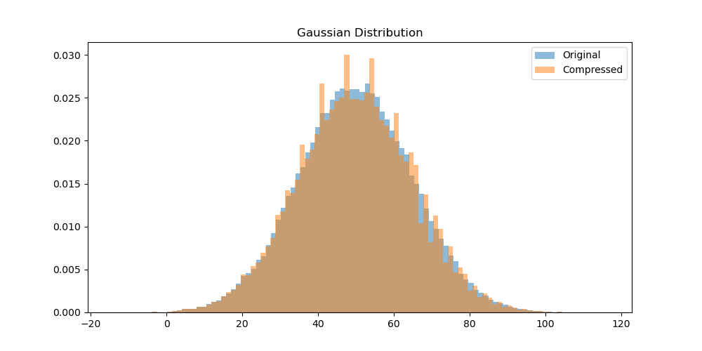
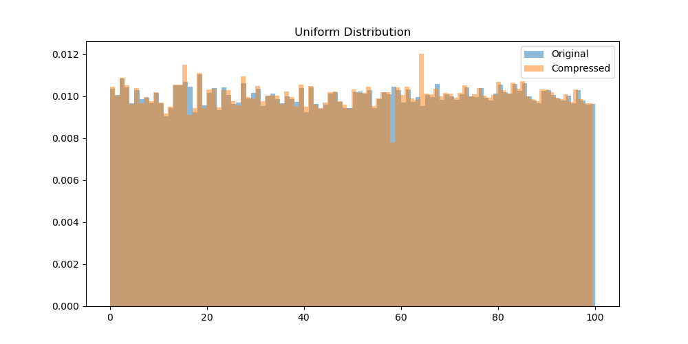
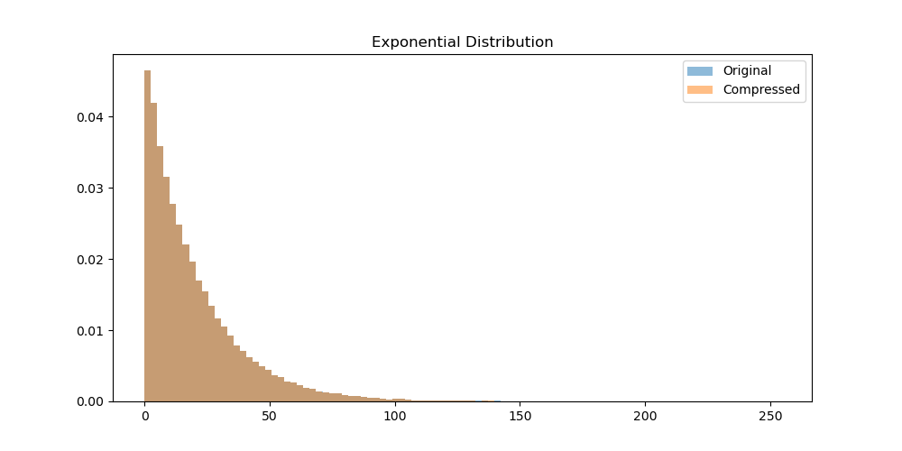
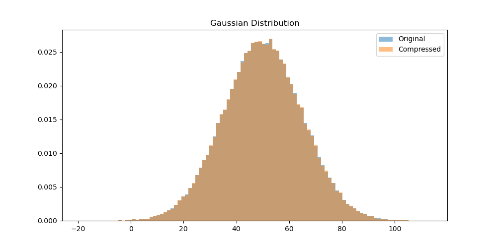
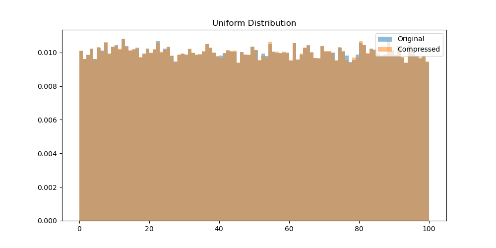
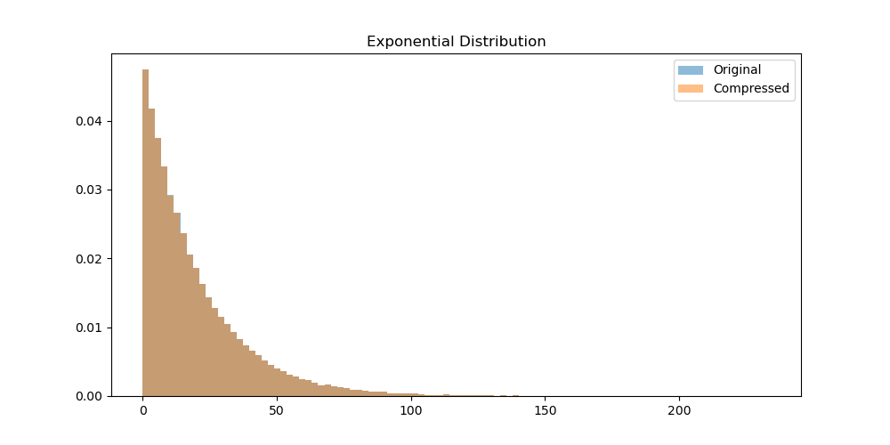
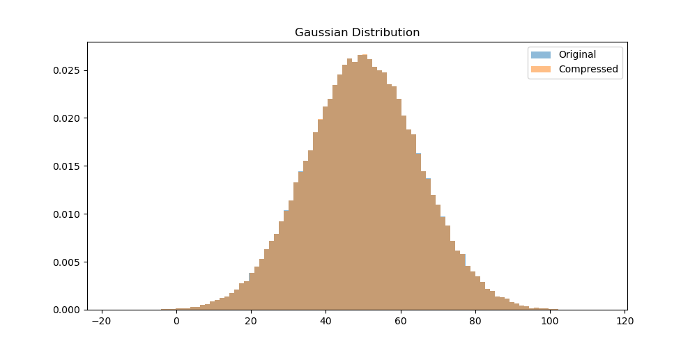
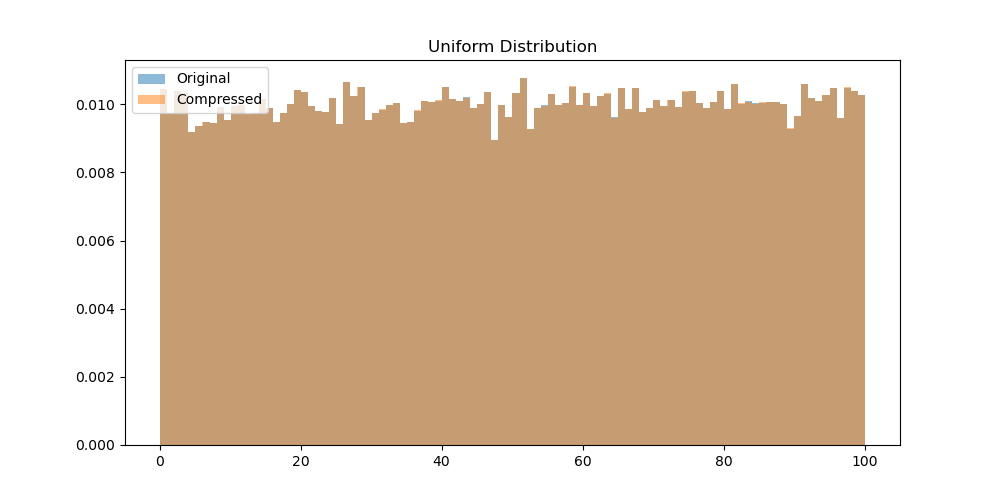

# Lossy Floating-Point Compression

## Overview
This project demonstrates a lossy compression technique for floating-point numbers by zeroing out a specific number of least significant bits (LSBs). The goal is to reduce storage while maintaining statistical fidelity.

## Features
- Generates three types of datasets: **Uniform, Gaussian, and Exponential** distributions.
- Applies lossy compression by zeroing out **8-16 least significant bits** of the floating-point representation.
- Saves original and compressed data as binary files.
- Compares statistical properties between original and compressed datasets.
- Visualizes the effects of compression using histograms.

## Dependencies
Ensure you have the following Python libraries installed:
```bash
pip install numpy matplotlib
```

## Usage
Run the script using:
```bash
python code.py
```

### Data Generation
The script generates **1,000,000 samples** for each distribution:
- **Uniform Distribution**: Random values between 0.1 and 500.0
- **Gaussian Distribution**: Mean = 50.0, Standard Deviation = 175.0
- **Exponential Distribution**: Scale = 180.0

### Compression Algorithm
The compression function:
1. Converts the floating-point number to its 32-bit integer representation.
2. Zeroes out the **16 least significant bits**.
3. Converts it back to a floating-point number.

```python
int_rep = struct.unpack('>I', struct.pack('>f', num))
        
int_rep &= ~((1 << bits_to_zero) - 1)

compressed_data[i] = struct.unpack('>f', struct.pack('>I', int_rep))
```

### File Storage
Original and compressed data are saved as binary files:


### File Size Reduction
The script measures file sizes before and after compression


### Statistical Comparison
The script compares:
- **Mean**
- **Standard Deviation**
- **Minimum and Maximum Values**
- **Mean Squared Error (MSE)**


### Data Visualization
Histograms compare original vs. compressed distributions:


## Different Cases 

### Bits zero out : 16
  

```python
Uniform original: 390.62 KB, Compressed: 388.22 KB
Gaussian original: 390.62 KB, Compressed: 388.21 KB
Exponential original: 390.62 KB, Compressed: 388.22 KB

Uniform Distribution:
Mean - Original: 50.106590, Compressed: 49.962704
Std Dev - Original: 28.858265, Compressed: 28.774538
Min - Original: 0.100631, Compressed: 0.100586
Max - Original: 99.999115, Compressed: 99.500000
MSE: 3.785957e-02

Gaussian Distribution:
Mean - Original: 50.019604, Compressed: 49.880627
Std Dev - Original: 15.077870, Compressed: 15.032394
Min - Original: -16.333557, Compressed: -16.250000
Max - Original: 113.529121, Compressed: 113.500000
MSE: 2.985908e-02

Exponential Distribution:
Mean - Original: 20.068439, Compressed: 20.012180
Std Dev - Original: 20.063385, Compressed: 20.007545
Min - Original: 0.000466, Compressed: 0.000465
Max - Original: 255.865433, Compressed: 255.000000
MSE: 8.755062e-03
```

### Bits zero out : 12
  

```python
Uniform original: 390.62 KB, Compressed: 389.10 KB
Gaussian original: 390.62 KB, Compressed: 389.10 KB
Exponential original: 390.62 KB, Compressed: 389.10 KB

Uniform Distribution:
Mean - Original: 50.105965, Compressed: 49.819210
Std Dev - Original: 28.773354, Compressed: 28.606339
Min - Original: 0.101038, Compressed: 0.100586
Max - Original: 99.998375, Compressed: 99.000000
MSE: 1.501167e-01

Gaussian Distribution:
Mean - Original: 49.985294, Compressed: 49.708076
Std Dev - Original: 15.014332, Compressed: 14.924984
Min - Original: -12.203474, Compressed: -12.125000
Max - Original: 108.780708, Compressed: 108.000000
MSE: 1.181116e-01

Exponential Distribution:
Mean - Original: 20.018286, Compressed: 19.905569
Std Dev - Original: 20.100245, Compressed: 19.986811
Min - Original: 0.000060, Compressed: 0.000060
Max - Original: 278.785614, Compressed: 276.000000
MSE: 3.537661e-02
```

## Bits zero out : 8
  

```python
Uniform original: 390.62 KB, Compressed: 390.22 KB
Gaussian original: 390.62 KB, Compressed: 390.22 KB
Exponential original: 390.62 KB, Compressed: 390.22 KB

Uniform Distribution:
Mean - Original: 50.042374, Compressed: 49.899090
Std Dev - Original: 28.876808, Compressed: 28.793491
Min - Original: 0.101220, Compressed: 0.101074
Max - Original: 99.999763, Compressed: 99.500000
MSE: 3.761775e-02

Gaussian Distribution:
Mean - Original: 49.918285, Compressed: 49.779148
Std Dev - Original: 15.021898, Compressed: 14.976630
Min - Original: -14.250852, Compressed: -14.250000
Max - Original: 116.342224, Compressed: 116.000000
MSE: 2.983606e-02

Exponential Distribution:
Mean - Original: 20.033802, Compressed: 19.977514
Std Dev - Original: 20.147211, Compressed: 20.090912
Min - Original: 0.000434, Compressed: 0.000433
Max - Original: 241.065247, Compressed: 241.000000
MSE: 8.839354e-03
```

## Observations
- Compression reduces file size.
- Mean and standard deviation remain close to original values.
- **Higher compression (more bits zeroed) increases MSE**.
- This method is useful for storage reduction in scenarios where **perfect precision is not required**.
- Changing different parameters in the distributions doesnot led to much diffrenece in compression size but had impact on the stats values (MSE, Mean, Std Dev).


## Optimal Compression Levels for Differnt Use Cases

1. High Precision 
    1. Bits to zero : 5-8
    2. Useful in cases where we require high precision
    3. Financial and Scitific data

2. Normal Precision
    1. Bits to zero : 8-12
    2. Useful in normal data storage 
    3. ML database

3. High Compression
    1. Bits to zero : 12-16
    2. Storage is the main concern
    3. Loss in precision
    4. Video and image processing, games

## License
This project is licensed under the MIT License.

## Refernces

* [Athena C++ Float Compressor](https://gitlab.cern.ch/atlas/athena/-/blob/main/Control/CxxUtils/Root/FloatCompressor.cxx)

* [IEEE 754](https://en.wikipedia.org/wiki/IEEE_754)

* [Stack overflow](https://stackoverflow.com/questions/8630609/compressing-floating-point-data)

* [Lossy Compression](https://en.wikipedia.org/wiki/Lossy_compression)